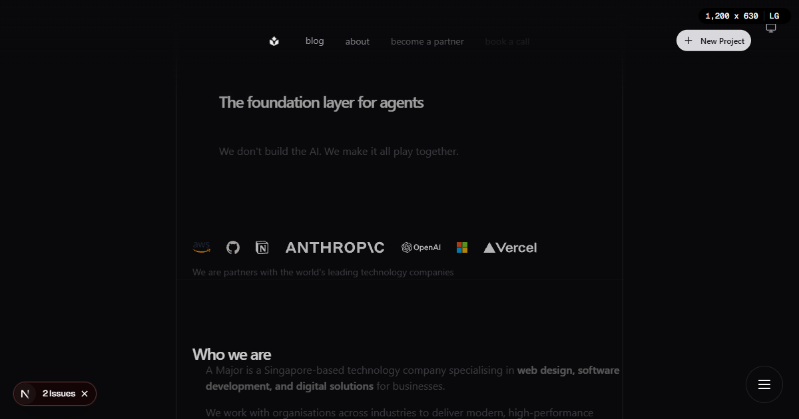

<table width="100%">
  <tr>
    <td align="center" width="120">
      
    </td>
    <td align="right">
      <h1>A Major</h1>
      <h3 style="margin-top: -10px;">The key to AI agents. We don't build the AI. We make it all play together.</h3>
    </td>
  </tr>
</table>



### Local Development

1. Clone the repository

   ```bash
   git clone https://github.com/amajorai/landing.git
   cd landing
   ```

2. Install dependencies

   ```bash
   bun install
   ```

3. Set up environment variables

   ```bash
   cp .env.example .env.local
   ```

4. Start the development server

   ```bash
   bun dev
   ```
